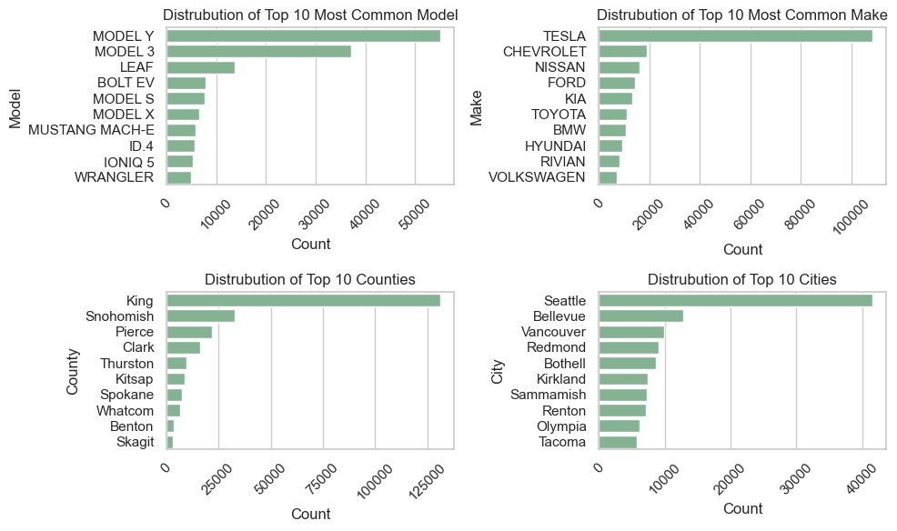
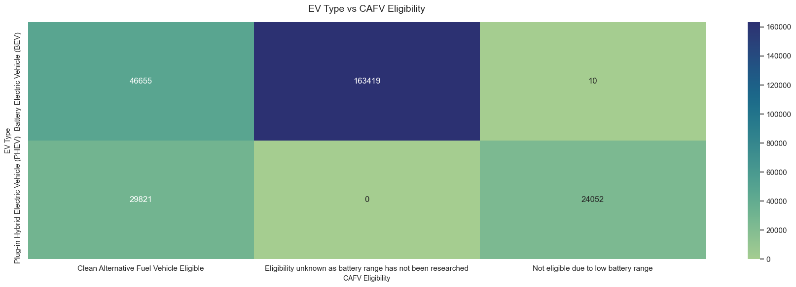
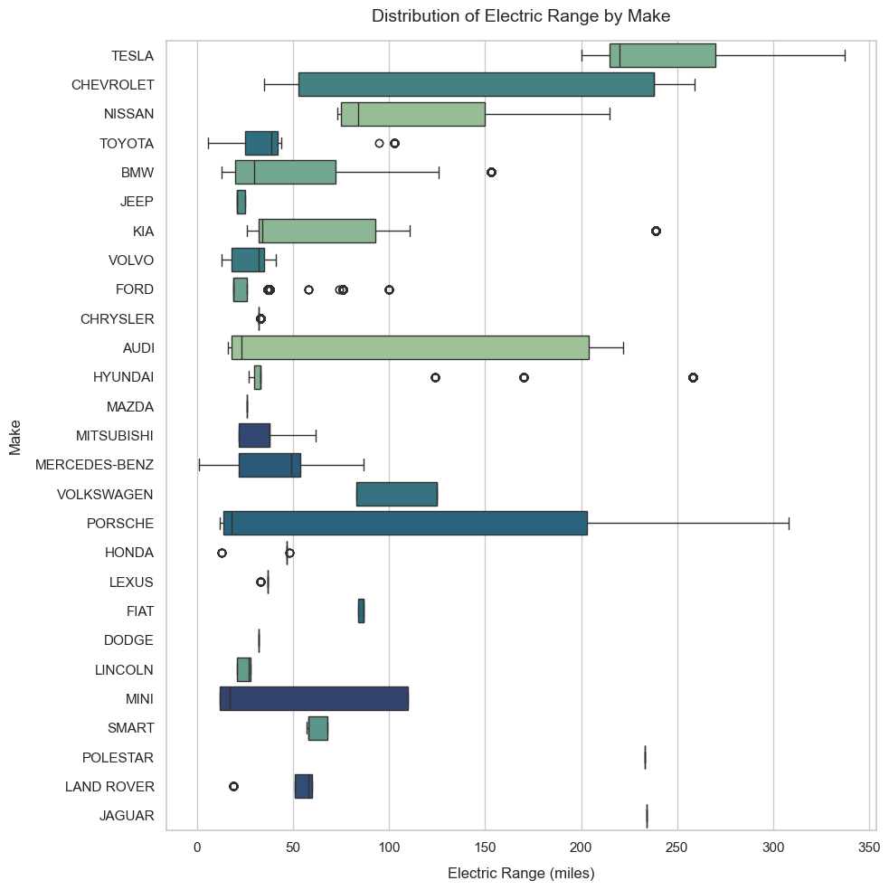
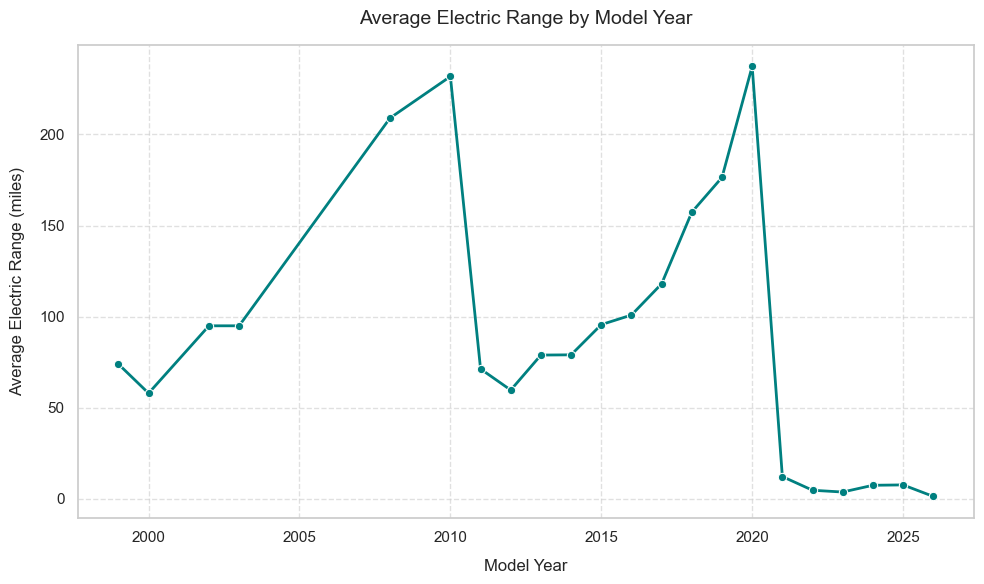

# 🚗 Exploring Electric Vehicle Adoption Trends in Washington State

## 📘 Project Overview
This project explores **Electric Vehicle (EV) adoption trends** across Washington State using the official **Electric Vehicle Population dataset**.  
The analysis focuses on identifying the most popular EV models, manufacturers, and geographic concentrations of adoption.

---

## 🔍 Data Source
The dataset was sourced from Data.gov **[Electric Vehicle Population Data](https://catalog.data.gov/dataset/electric-vehicle-population-data)**. 

---

## 🧰 Tools and Libraries
- **Python 3.9+**
- **pandas**
- **numpy**
- **matplotlib**
- **seaborn**
- **Jupyter Notebook**

---

## 📊 Key Insights
- **Tesla** dominates EV adoption, with over 100,000 registered vehicles.
- **Model Y** and **Model 3** are the two most common EVs.
- **King County** and **Seattle** lead the state in EV ownership.
- **Battery Electric Vehicles (BEVs)** are more prevalent and CAFV-eligible than **PHEVs**.
- **Average electric range** has steadily increased over the years.

---

## 📈 Visualizations
- Top 10 EV Models, Makes and Locations

- EV Type vs CAFV Eligibility Heatmap

- Boxplot: Electric Range by Make

- Line Chart: Electric Range by Model Year  

---

📚 Medium Article
Want the full walkthrough and visual story behind the analysis?
👉 Read the full Medium post here **[Read the full Medium post here]((https://medium.com/@thomasanthonio/exploring-electric-vehicle-adoption-trends-in-washington-state-621f1a9475ca))**This article explains the data cleaning, visualization process, and findings in a more conversational and educational style.

---

## 📂 Project Structure
├── data/
├── notebooks/
├── images/
├── requirements.txt
├── LICENSE
└── README.md

